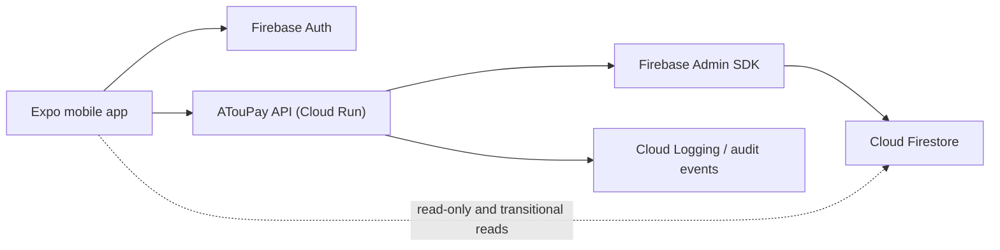

# ATouPay Backend Architecture

## Current State

ATouPay already has a backend in the Firebase sense:

- Firebase Authentication handles user identity
- Cloud Firestore stores users, owners, properties, units, invites, payments, and receipts
- Firestore Security Rules enforce access boundaries

What the repo does **not** have today is a dedicated ATouPay application backend.

There is no Express, Fastify, NestJS, Cloud Run service, or Cloud Functions service in this repository. Sensitive write paths such as invite creation, invite redemption, and simulated payment settlement currently run from the mobile client through Firestore transactions plus Security Rules.

That is acceptable for a prototype, but it is not the right long-term boundary for:

- authoritative business logic
- auditability
- external integrations
- admin workflows
- anti-abuse controls
- future real payment provider work

## Design Goal

Add a thin ATouPay backend without replacing the current Firebase foundation.

The recommended V1 architecture is:

- keep Firebase Auth as the identity provider
- keep Firestore as the primary data store
- add a small Node.js + TypeScript API service for sensitive mutations
- keep payments explicitly simulated until a real provider is approved and integrated

## Recommended Backend Stack

### Runtime

- Node.js 22
- TypeScript
- Fastify

### Hosting

- Google Cloud Run

This fits the existing GCP-first environment and keeps deployment simple.

### Data and identity

- Firebase Auth for user sign-in and session issuance
- Firebase Admin SDK in the backend for token verification and Firestore writes
- Cloud Firestore remains the system of record for V1

### Secrets and config

- Google Secret Manager for service config and future provider credentials
- no Firebase service account JSON committed into the repo

### Delivery

- GitHub Actions builds and deploys the backend container
- environment promotion stays explicit across `development`, `preview`, and `production`

## Why Keep Firebase Auth

Firebase Auth is already wired into the app for:

- Google sign-in
- e-mail/password sign-up and sign-in
- password reset
- e-mail verification

Replacing it now would create migration risk without solving the current problem. The backend should trust Firebase as the identity layer and verify Firebase ID tokens on every authenticated request.

## Proposed Responsibility Split

### Mobile app

- render UI
- obtain Firebase ID token after login
- send authenticated API requests
- keep low-risk reads on Firestore for now, where practical

### Firebase Auth

- issue and refresh identity tokens
- manage password and Google providers
- report provider and verification state

### ATouPay API

- verify Firebase ID tokens
- authorize owner versus tenant actions
- execute sensitive writes with the Firebase Admin SDK
- emit audit logs
- centralize validation and business rules

### Firestore

- persist operational data
- remain the source of truth for user, owner, property, unit, invite, payment, and receipt records

## Proposed V1 System Diagram



## Data Model Alignment

The backend should preserve the current Firestore collections already used by the app:

- `users`
- `owners`
- `properties`
- `units`
- `tenants`
- `tenantInvites`
- `rentPayments`
- `receipts`

That avoids a migration while the product scope is still narrow.

### Current meaning of those collections

- `users/{uid}`: application-level identity, role, provider info, owner/tenant binding
- `owners/{ownerId}`: owner profile
- `properties/{propertyId}`: owner-owned building or property
- `units/{unitId}`: rentable unit under a property
- `tenants/{tenantId}`: tenant assignment to a specific unit
- `tenantInvites/{inviteId}`: single-use invite metadata tied to one unit
- `rentPayments/{paymentId}`: simulated rent payment lifecycle
- `receipts/{receiptId}`: generated receipt records for simulated rent settlement

## Backend Responsibilities To Move Server-Side First

### 1. Profile bootstrap

The backend should own:

- first-time app profile creation in `users/{uid}`
- owner profile creation in `owners/{ownerId}` when role is `owner`
- role lock rules once an account is active

### 2. Owner property and unit creation

The backend should own:

- property creation
- unit creation
- validation that the caller owns the parent property

### 3. Invite issuance

The backend should own:

- single-use invite generation
- hashed invite code persistence
- expiry timestamp creation
- optional invite e-mail restriction
- unit state transition from `vacant` to `invited`

### 4. Invite redemption

This is the most important write path to centralize.

The backend should own:

- invite validation
- expiry checking
- single-use enforcement
- optional e-mail match enforcement
- unit occupancy check
- tenant record creation
- `users/{uid}` tenant attachment
- pending rent payment seeding

This must happen in one server-side transaction.

### 5. Simulated payment completion

Payments must remain explicitly simulated in this MVP.

The backend should own:

- settlement of a simulated payment record
- simulated provider reference creation
- receipt creation
- status transition to `paid`
- audit log of who triggered the simulation

## API-First Rollout Strategy

### Phase 0: Current state

- Firebase Auth + Firestore only
- client performs sensitive transactions
- Firestore rules carry a large share of business enforcement

### Phase 1: Sensitive write API

Implement backend endpoints for:

- profile bootstrap
- property creation
- unit creation
- invite creation
- invite redemption
- simulated payment completion

Keep current Firestore reads in the client to minimize migration risk.

### Phase 2: Tighten client write access

After the API is proven:

- reduce Firestore client write permissions
- allow direct client reads only where still needed
- move more ownership-sensitive queries behind the API if needed

### Phase 3: Reporting and integrations

Only after V1 flows are stable:

- receipt export generation
- owner reporting
- notification dispatch
- eventual real payment provider integration

## Recommended Backend Service Layout

When implementation starts, add a dedicated service rather than mixing backend code into the Expo app:

```text
backend/
  package.json
  tsconfig.json
  src/
    app.ts
    server.ts
    config/
    middleware/
    routes/
    services/
    repositories/
    validators/
    lib/firebase-admin.ts
```

## Security Design

### Authentication

- every authenticated backend request must carry a Firebase ID token
- backend verifies tokens with Firebase Admin SDK
- backend derives caller identity from verified token, never from client-supplied `uid`

### Authorization

- owners may only mutate resources they own
- tenants may only redeem invites for themselves
- tenants may only see their assigned unit, payments, and receipts
- backend must treat role, ownerId, tenantId, and unitId as authoritative server-side values

### Input validation

- validate all request bodies server-side
- normalize e-mail input to lowercase
- never persist raw invite codes when a hash can be used instead
- return stable error codes for the mobile app

### Audit

The current backend stores minimal operational audit records in `auditLogs/{auditLogId}` for:

- owner access invite creation/revocation
- owner activation
- tenant invite creation/redemption
- simulated payment completion
- support request creation/update
- account suspension/reactivation

This audit log is for product traceability. It is not a full SIEM, accounting ledger, or legal evidence platform.

### Notifications

In-app notification records live in `notifications/{notificationId}` and are backend-owned. They currently support payment, invite, support, and account-status events. Push notifications are intentionally out of scope until push tokens, opt-in, provider credentials, and delivery verification are implemented.

## Firestore Rules After Backend Introduction

Firestore rules should remain in place even after the backend exists.

Recommended direction:

- continue allowing direct client reads for allowed role-scoped data
- progressively remove direct client writes for invites, units, tenants, payments, and receipts
- keep backend service account as the main writer for sensitive state transitions

## Non-Goals For This Backend Pass

- no real payment gateway integration
- no maintenance workflows
- no artisan dispatch
- no marketplace or tenant discovery
- no listings search

## Current Backend Boundary

The backend now owns sensitive writes for role bootstrap, owner access invites, owner inventory writes, tenant invite redemption, simulated payment completion, receipt issuance, support, terms acceptance, account suspension, notifications, dashboard summaries, and audit logs.

The mobile app still performs selected Firestore reads directly for low-risk live UI rendering. Future fintech/payment-provider work should plug in behind backend-owned payment finalization boundaries rather than adding provider logic directly to the mobile client.
